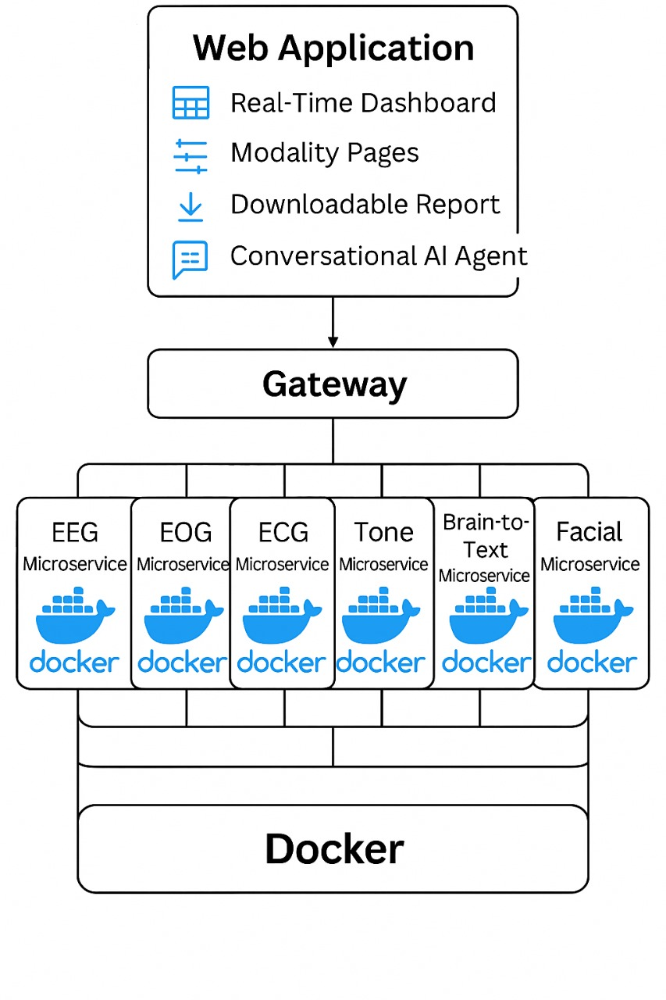

# NeuroAI Backend

This project is part of the NeuroAI platform, a multi-modal AI-powered backend designed to support psychiatric diagnosis through emotion recognition and subconscious analysis.  
This project was developed as part of the coursework for **ESE.INFIA0010 - AI Project** at **Esprit School of Engineering**.

## Overview

NeuroAI Backend implements a **multi-container microservices architecture** in Docker to process real-time emotion detection and brain-to-text insights using Deep Learning models.  
Each microservice is responsible for a distinct modality (EEG&EOG, EEG during activity, ECG, speech, facial, Brain-to-text), and all data is aggregated via a gateway for streamlined communication.

## Features

- Multi-modal approach to emotion recognition
- Dockerised Microservice architecture for portability, scalability and flexibility
- Supports various emotion recognition modalities:
  - 🎤 **Speech Emotion Recognition**
  - 👤 **Facial Emotion Recognition**
  - 🧠 **EEG&EOG Emotion Interpretation**
  - ❤️ **ECG-Based Emotional Analysis**
  - 🕹️ **Gaming-Stimulated EEG Emotion Tracking**
- 🧠 **Brain-to-text interpretation using EEG signals**

## Tech Stack

- **Backend**: Python, Flask.
- **AI/ML**: TensorFlow, PyTorch, Deep Learning.
- **Infrastructure**: Docker, Docker Compose, Reverse Proxy Gateway.
- **Other Tools**: Postman, Jupyter Notebooks, ngrok.

## Directory Structure

root/
│
├── microservices/
│ ├── microservice_a/ # One use case (e.g. speech)
│ ├── microservice_b/ # Another use case (e.g. facial)
│ └── ...
│
├── gateway/ # API gateway (user entry point)
├── docker-compose.yml # Runs all microservices together
└── README.md

## Getting Started

1. Clone the repository.
2. Build and run all services: `docker-compose up --build`
3. Use the API Gateway to make requests.

## Usage

The gateway is a single entry point. It receives user requests and redirects them to the right microservice based on the endpoint path.

## Contributing

Check out `CONTRIBUTING.md` for guidelines.

## Acknowledgments

This project was developed as part of the coursework for AI project (ESE.INFIA0010) at Esprit School of Engineering.

Special thanks to

- **Prof. Sonia Mesbeh** (sonia.mesbeh@esprit.tn)
- **Prof. Jihene Hlel** (jihene.hlel@esprit.tn)

for their invaluable guidance from ideation and model training through to system architecture and deployment.

## Topics

- artificial-intelligence
- deep-learning
- machine-learning
- data-analysis
- web-development
- python
- flask
- API
- docker
- containerization
